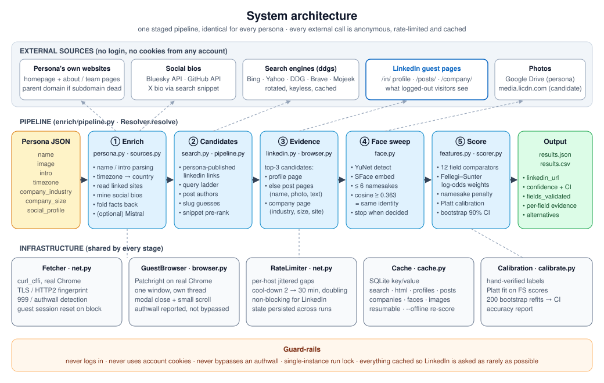
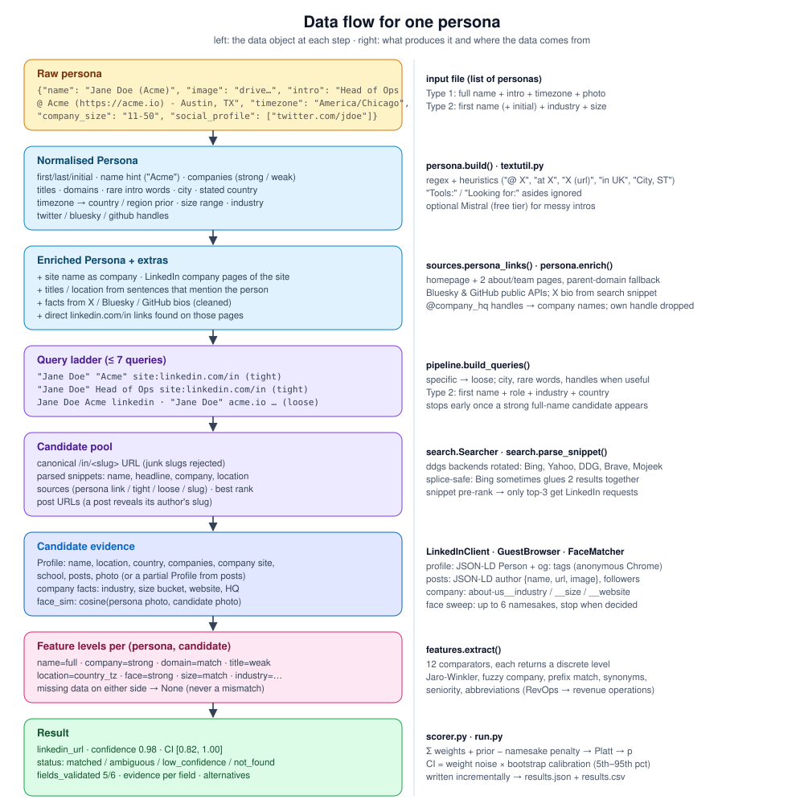
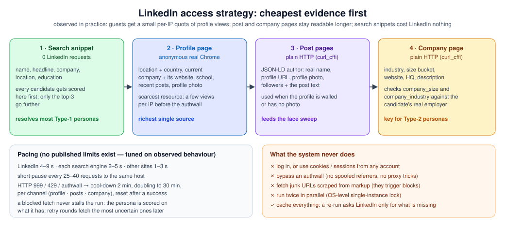
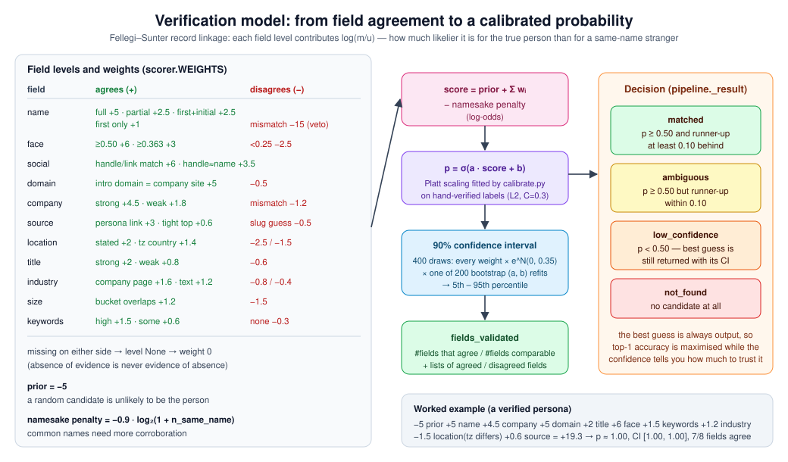

# Persona-Profile-Resolver

**Resolve a partial persona (a name, a photo, a one-line intro, a timezone, some company facts) to the person's public LinkedIn profile, and say how sure you are.**

No LinkedIn account is used, ever. Every request is an anonymous guest request, paced like a human and cached, so a run can be interrupted and resumed at any time.

<p align="center">
  
</p>

---

## Contents

1. [Results at a glance](#1-results-at-a-glance)
2. [The problem](#2-the-problem)
3. [What the data looks like](#3-what-the-data-looks-like)
4. [Architecture](#4-architecture)
5. [Data flow, stage by stage](#5-data-flow-stage-by-stage)
6. [Getting data out of LinkedIn without logging in](#6-getting-data-out-of-linkedin-without-logging-in)
7. [The verification model](#7-the-verification-model)
8. [Results in detail](#8-results-in-detail)
9. [Quick start](#9-quick-start)
10. [Output format](#10-output-format)
11. [Configuration](#11-configuration)
12. [Repository structure](#12-repository-structure)
13. [Testing](#13-testing)
14. [Engineering notes: problems found and fixed](#14-engineering-notes-problems-found-and-fixed)
15. [Limitations and next steps](#15-limitations-and-next-steps)
16. [Responsible use](#16-responsible-use)

---

## 1. Results at a glance

| Metric | Value |
|---|---|
| Personas processed | **17** (12 Type 1, 5 Type 2) |
| Hand-verified personas resolved to the correct profile (top-1) | **9 / 9 (100 %)** |
| Personas the system marked `matched` | 9, all of them correct |
| Precision of `matched` | **100 %** |
| Calibration quality (Brier score, 50 candidate pairs) | 0.046 → **0.012** after Platt scaling |
| LinkedIn login / cookies used | **none** |
| Offline tests | 13, all passing |

What resolved the 9 matches (several per persona):

| Evidence that agreed | Personas |
|---|---|
| name | 9 |
| company (stated, website name, or a rare word from the intro) | 8 |
| face (persona photo vs the profile or post-author photo) | 4 (one of them unresolvable without it) |
| company website domain = domain in the intro | 3 |
| a handle spelled from the candidate's name / a direct link from the persona's own site | 3 |

The 8 personas that did **not** reach `matched` are all reported as `low_confidence`, each with its best guess, a wide interval and the reasons. Mostly these are first-name-only Type-2 personas and very common names with no usable photo. See [§8](#8-results-in-detail).

---

## 2. The problem

**Stage 1, identification.** Given a persona whose fields vary from rich to almost empty, find the person's LinkedIn profile:

```json
{ "name": "...", "image": "...", "intro": "...", "timezone": "...",
  "company_industry": "...", "company_size": "...", "social_profile": [...] }
```

**Stage 2, verification.** For each answer, output a confidence such as "80 % probability that this persona is this profile". It should be driven by **how many fields** agree between the persona and the profile, and **how strongly** they agree.

Accuracy counts most, then the quality of the verification pipeline, then how innovative the approach is.

---

## 3. What the data looks like

Two sample sets were analysed field by field before any code was written:

| Field | Type 1 (12 personas) | Type 2 (5 personas) | How it is used |
|---|---|---|---|
| `name` | full name for 10; one handle (`FirstnameX`); one with a company in brackets | first name only, or first name + initial | search terms, name comparison, namesake count |
| `image` | 12 / 12 (Google Drive links) | 2 / 5 | face sweep (photos are *not guaranteed* to show a real face) |
| `intro` | 10 / 12: company, title, URLs, interests, city | 3 / 5, generic ("Founder in US") | companies, titles, domains, rare words, city, country; linked websites are read |
| `timezone` | 12 / 12 | 0 / 5 | country / region prior (`Africa/Monrovia`-style "UTC" zones are treated as weak) |
| `company_industry` | 2 / 12 | 3 / 5 | compared against the candidate's company page and text |
| `company_size` | 0 / 12 | 5 / 5 | compared against the candidate's company-page size bucket |
| `social_profile` | 3 / 12 (X, Bluesky) | 0 / 5 | bios mined into the persona; handle ↔ name check |

The two types need different things:
- **Type 1** is a *search-and-verify* problem. Searching finds the person quickly; the hard cases are common names.
- **Type 2** is a *needle in a haystack*. A first name says almost nothing, so evidence has to come from role + industry + company size + country + face.

The system is built to use **every field for every persona**. Type 2 isn't a special code path.

---

## 4. Architecture

The diagram at the top shows the whole system. It has three layers.

**External sources** (all anonymous):
- the persona's own websites
- social bios: Bluesky and GitHub through their public APIs, X through its search-engine snippet
- keyless web search through [`ddgs`](https://pypi.org/project/ddgs/), rotating Bing, Yahoo, DuckDuckGo, Brave and Mojeek
- LinkedIn guest pages (profile, post, company)
- photos: the persona's Google Drive image and the candidate's `media.licdn.com` image

**The pipeline** is `enrich/pipeline.py`, `Resolver.resolve()`. It runs five stages, identical for every persona:

| # | Stage | What it does | Main modules |
|---|---|---|---|
| ① | **Enrich** | Normalise the persona, read the websites it links to, mine its social bios, fold every fact back into the persona | `persona.py`, `sources.py`, `textutil.py`, `llm.py` (optional) |
| ② | **Candidates** | Links the persona itself publishes, a query ladder over search engines, authors of LinkedIn posts in the results, slug guesses; snippet-based pre-ranking | `search.py`, `pipeline.py` |
| ③ | **Evidence** | For the top 3 candidates: the guest profile page; if walled, the post pages (author name + photo + text); the employer's company page (industry, size, website) | `linkedin.py`, `browser.py` |
| ④ | **Face sweep** | Up to 6 plausible same-name candidates each get a photo comparison | `face.py` |
| ⑤ | **Score** | 12 field comparators → Fellegi–Sunter weights → namesake penalty → Platt calibration → bootstrap confidence interval → decision | `features.py`, `scorer.py` |

**Infrastructure** shared by all stages:
- `net.py`: polite fetcher and rate limiter
- `browser.py`: anonymous real-Chrome session
- `cache.py`: SQLite cache, so runs are resumable and `--offline` re-scoring needs no network
- `calibrate.py`: fits the calibration from labels and reports accuracy

---

## 5. Data flow, stage by stage

<p align="center">
  
</p>

### ① Enrich: squeeze every field before touching LinkedIn

**Names** (`persona.parse_name`):
- `"Jane Roe (Acme)"` → first + last name, plus the bracketed part as a company hint
- `"JordanW"` → first name + last initial *W*
- `"Alex S."` → first name + initial
- Nicknames are understood at matching time (Chris ↔ Christopher, Jeff ↔ Jeffrey, …).

**Intro** (`persona.parse_intro`): rules that recognise
- `X @ Company`, `X at Company`, `Founder of X`, `Name (https://…)` patterns
- bare domains (`Acme-labs.com`)
- titles, through a vocabulary of role words and seniority levels
- "in UK" / "based in …" / `City, ST`
- `Tools:` / `Looking for:` asides are dropped, because a list of tools is not a list of employers.

Companies are split into **strong** (explicitly stated) and **weak** (capitalised fragments, past employers).

**Timezone** gives a country or region prior. `America/Chicago` → US. `Asia/Kolkata` → IN. "UTC-like" zones such as `Africa/Monrovia` are marked weak, because people pick them without living there.

**Websites** (`sources.analyse_site`): the homepage plus up to two `about`/`team`/`founder` pages. If a subdomain is dead, the parent domain is tried. From each site it extracts:
- **direct `linkedin.com/in/…` links**, the strongest evidence there is. Team pages are discounted by how many profiles they list.
- the **site's own name**, which becomes a stated company (`og:site_name` or `<title>`, trimmed at the first separator)
- **`linkedin.com/company/…` links**, compared later with the candidate's employer page
- **sentences that mention the person**, which yield title, role, location and keywords

**Social bios:**
- **Bluesky**: the public `getProfile` API
- **GitHub**: the public users API, which gives name, company, blog, location and bio
- **X / Twitter**: can't be read without login, but search engines index the profile page, so the handle is searched and the bio comes from the snippet.

Bios are cleaned before parsing. Page boilerplate is stripped ("Name (@handle) / X"), along with crawler placeholders and the persona's own handle. Company handles are turned into names: `@dock_us` → "Dock".

**Optional:** with `MISTRAL_API_KEY` set (the free tier is enough), an LLM adds companies/titles/country for messy intros. The rule-based parser always runs; the LLM only adds.

### ② Candidates: cast a wide but precise net

**Query ladder** (`pipeline.build_queries`), at most 7 queries, ordered from tight to loose, for example:

```
"Full Name" "Company" site:linkedin.com/in         ← tight
"Full Name" <most senior title> site:linkedin.com/in
"Full Name" <City> site:linkedin.com/in
"Full Name" <rare intro words>                    ← e.g. a product name only this person mentions
Full Name Company linkedin · "Full Name" domain.com linkedin · Full Name linkedin <Country>   ← loose
```

- Type 2 personas use first name + role + industry + country.
- Searching stops early once a strong full-name candidate appears.

**Every search result is mined:**
- `linkedin.com/in/<slug>` results become candidates with a parsed snippet (name, headline, company, location, education). The parser knows Bing's older and newer snippet layouts.
- `linkedin.com/posts/<slug>_…` results reveal the **author's profile slug**. The post text becomes evidence, and the post URL is kept for stage ③.
- Slugs are validated, so markup junk such as `jane-doe-)43:t751` is rejected. Fetching that kind of URL got us blocked once.

**Slug guesses** (`/in/firstlast`, `/in/first-last`) are added only when nobody with the right name was found.

**Snippet pre-ranking:** every candidate is scored on its snippets alone, and only the top 3 move on to LinkedIn requests.

### ③ Evidence: profile → posts → company

For each leading candidate, best first, the system collects:

1. **Profile page.** An anonymous real Chrome (Patchright) loads `/in/<slug>`. The parser reads the stable, SEO-facing parts: JSON-LD `Person` and `og:` tags. That gives name, location and country, current company and its **website link**, school, recent posts, awards and photo. Fields LinkedIn masks for guests (`****`) are ignored.
2. **Post pages** when the profile is walled or has no photo. Guest post pages carry the **author's name, profile URL, profile photo and follower count** in JSON-LD, plus the post text. They stay readable for guests much longer than profile pages.
3. **Company page** of the current employer, found through the profile or a `"Company" site:linkedin.com/company` search. It gives **industry, size bucket, website, HQ and description**. This is what makes `company_size` and `company_industry` checkable for every persona.

Evidence gathering stops for a persona as soon as one fetched candidate is decisively ahead: p ≥ 0.95 and at least 0.5 above the runner-up.

### ④ Face sweep

- **Models:** OpenCV's **YuNet** face detector and **SFace** face embedder, both open-source ONNX models (Apache-2.0) that run on CPU in about 20 ms. They are downloaded automatically on first use.
- **When it runs:** whenever the persona has a detectable face, up to 6 plausible same-name candidates get a photo, from their profile or their posts.
- **Threshold:** cosine similarity ≥ 0.363 is SFace's published same-identity threshold.
- **No face on either side** → the face feature is *unknown*, never a mismatch. The task says persona photos may not be real.

This is the step that solved the hardest Type 1 case: a common name with about ten namesakes and a dead website. The persona photo matched one candidate at **0.95** and ruled out the others.

### ⑤ Score → see [§7](#7-the-verification-model)

---

## 6. Getting data out of LinkedIn without logging in

<p align="center">
  
</p>

What we measured, rather than assumed:

- **No published limits.** LinkedIn publishes no rate limit for guests, and neither do the search engines. HTTP `999` is driven mainly by **client fingerprint and IP reputation**, not by request spacing.
- **Plain HTTP gets fingerprinted quickly.** A plain HTTP client, even one with Chrome's TLS fingerprint, got `999` on profiles even after **6 idle hours**. An anonymous **real Chrome** loaded the same profile on its first try.
- **The profile-view quota is per IP.** Each IP gets only a few guest **profile** views before the authwall, whatever the client or spacing. Waiting 45 s between requests buys nothing.
- **Post and company pages stay readable much longer** over plain HTTP. They became the workhorse channels.

The pipeline is built around those facts:

| Mechanism | Detail |
|---|---|
| Cheapest evidence first | Search snippets (no LinkedIn request at all) → profile → posts → company |
| Human pacing | LinkedIn 4–9 s, each search engine 2–5 s, other sites 1–3 s, plus short pauses every 25–40 requests |
| Per-channel cool-downs | Profile, posts and company pages each back off on their own: 2 min, doubling to 30 min, reset after a success, persisted across restarts |
| Never stall | While a channel cools down, the persona is scored on what it already has. **Retry rounds** at the end re-fetch the most uncertain personas first |
| Non-public ≠ blocked | A post that redirects to the sign-up page with HTTP 200 is cached as "not public" and doesn't trigger a cool-down |
| Cache everything | A re-run asks LinkedIn only for what is still missing; `--offline` asks nothing |
| Single instance | An OS-level lock prevents two runs from doubling traffic and corrupting the log |

Running from a different network (for example a phone hotspot) gives a fresh guest quota. The cache makes that run continue where the last one stopped.

---

## 7. The verification model

<p align="center">
  
</p>

### Field comparators (`features.py`)

Each comparator returns a **discrete level**, or `None` when either side lacks the data:

| Field | Levels | How it is computed |
|---|---|---|
| `name` | full · partial · first_initial · first_only · last_only · mismatch | Jaro-Winkler on first/last; nickname table; initials ("Jane D." vs "Jane Doe"); honorifics, emoji and punctuation stripped |
| `company` | strong · weak · mismatch | fuzzy `token_set_ratio` on normalised names ("Acme AI (YC S23)" ≈ "Acme.ai"); long-prefix match ("acmeflowcraft" ≈ "AcmeFlow"); the persona's site linking the candidate's company page |
| `domain` | match · mismatch | an intro domain equals the profile's company-website link, the company page's website or the company slug |
| `title` | strong · weak · mismatch | fuzzy match after expanding abbreviations (RevOps → revenue operations) plus the same seniority level; exact title phrase in the candidate's own posts |
| `location` | country_stated · country_tz · region_tz · mismatch_stated · mismatch_tz | candidate country (JSON-LD, snippet or a city table) vs the stated country or the timezone prior |
| `face` | strong (≥ 0.50) · likely (≥ 0.363) · unclear · mismatch (< 0.25) | SFace cosine similarity |
| `social` | match · handle_name | handle or link found on the profile; profile linked from the persona's pages; handle spelled from the candidate's name tokens (`@janedoex` ≈ "Jane Doe X") |
| `keywords` | high · some · none | overlap of intro words with headline / about / posts / snippets, with prefix matching |
| `industry` | company_match · match · company_mismatch · none | the company page's industry (fuzzy + synonyms) first, then free text |
| `size` | match · mismatch | the persona's employee range overlaps the company page's size bucket |
| `source` | persona_link · team_page · tight_top · search · slug_guess | how the candidate was found |

### Scoring (`scorer.py`)

```
score = prior (−5) + Σ weight(field, level) − 0.9 · log₂(1 + namesakes)
p     = σ(a · score + b)                    # Platt scaling, fitted by calibrate.py
CI90  = 5th–95th percentile of p over 400 draws, where every weight is scaled by
        exp(N(0, 0.35)) and (a, b) is one of 200 bootstrap refits
```

- **Weights** are Fellegi–Sunter log-likelihood ratios, set from first principles; the full table is in the diagram. A name mismatch is effectively a **veto** (−15), because coworkers share company, domain and keywords.
- **Namesake penalty:** the more distinct profiles share the full name, the less the name alone proves. A first-name-only persona always assumes at least 3 namesakes; a known last initial assumes at least 1.
- **`fields_validated`** is reported exactly as the task asks: *the number of fields that agree / the number of fields that could be compared*, with the lists of agreeing and disagreeing fields.

### Calibration (`calibrate.py`)

```bash
python calibrate.py out/final/results.json --labels data/labels.json
```

1. Every scored candidate of every labelled persona becomes one example: 1 if it is the verified profile, 0 otherwise.
2. A Platt scaling `σ(a·score + b)` is fitted with strong L2 regularisation, because with few personas the classes are often perfectly separable.
3. 200 bootstrap refits are stored for the intervals.
4. The script prints top-1 accuracy and the Brier score before and after.

The fit is written to `models/calibration.json` and picked up automatically by every later run.

### Decision

| Status | Rule |
|---|---|
| `matched` | p ≥ 0.50 and the runner-up is at least 0.10 behind |
| `ambiguous` | p ≥ 0.50 but the runner-up is within 0.10 |
| `low_confidence` | p < 0.50; the best guess is still returned with its interval |
| `not_found` | no candidate at all |

The best guess is always returned, so top-1 accuracy is maximised, and the confidence says how far to trust it.

---

## 8. Results in detail

Final run (`out/final/results.json`), calibrated on the 9 hand-verified personas. Personas are shown as IDs: this is a public repository, and pairing real people's names with their LinkedIn URLs here would publish personal data.

| ID | Type | Status | p | 90 % CI | Fields agree | Profile evidence via | Agreeing fields | Verified |
|---|---|---|---|---|---|---|---|---|
| P01 | 1 | matched | 1.000 | 1.00–1.00 | 7/7 | profile page | name, company, domain, title, location, keywords, face | ✔ |
| P02 | 1 | matched | 0.814 | 0.16–1.00 | 3/3 | posts | name, company, **face 0.95** | ✔ |
| P03 | 2 | low_confidence | 0.052 | 0.01–0.34 | 3/3 | profile page | name (first + initial), location, keywords | — |
| P04 | 1 | matched | 0.953 | 0.46–1.00 | 4/5 | posts | name, company, location, keywords | ✔ |
| P05 | 1 | matched | 0.554 | 0.09–0.99 | 2/2 | posts | name, social (handle = name) | ✔ |
| P06 | 1 | matched | 0.856 | 0.23–1.00 | 5/5 | posts | name, company, title, location, keywords | ✔ |
| P07 | 1 | matched | 0.828 | 0.18–1.00 | 2/3 | snippet | name, company (rare intro word) | ✔ |
| P08 | 1 | matched | 1.000 | 1.00–1.00 | 7/8 | profile page | name, company, domain, title, keywords, industry, face | ✔ |
| P09 | 1 | matched | 1.000 | 0.99–1.00 | 6/6 | profile page | name, company, domain, location, keywords, industry | ✔ |
| P10 | 1 | matched | 0.986 | 0.82–1.00 | 4/5 | posts | name, company (own site links profile), keywords, face | ✔ |
| P11 | 1 | low_confidence | 0.040 | 0.01–0.74 | 4/4 | snippet | name, title, location, keywords | — |
| P12 | 1 | low_confidence | 0.137 | 0.01–0.92 | 2/2 | snippet | name, social (handle = name) | — |
| P13 | 2 | low_confidence | 0.003 | 0.00–0.01 | 2/2 | snippet | name (first only), size | — |
| P14 | 2 | low_confidence | 0.000 | 0.00–0.00 | 0/1 | posts | (last initial contradicts every candidate) | — |
| P15 | 2 | low_confidence | 0.044 | 0.01–0.36 | 4/5 | snippet | name, title, location, keywords | — |
| P16 | 2 | low_confidence | 0.019 | 0.01–0.12 | 4/4 | posts | name, title, keywords, industry | — |
| P17 | 2 | low_confidence | 0.077 | 0.02–0.50 | 4/4 | profile page | name, title, location, industry | — |

**How to read it:**

- **Every `matched` answer is a verified correct match.** No false positive reached `matched`.
- **Intervals show how much the answer rests on calibration.** A wide interval with a high p (P02, P05) means "probably right, but much of the confidence comes from one or two pieces of evidence". A tight one (P01, P08, P09) means many independent fields agree.
- **"Verified" uses independent evidence only:** a link from the person's own website, an employer named in the snippet that matches the intro, a near-identical face, or a handle that spells the name. It never relies on the system's own score.
- **Unresolved personas share one of three causes:**
  1. *A first name only* (P13–P17): dozens of plausible people. Company size and industry help, but LinkedIn company pages ran out of guest quota during the run.
  2. *A very common name with no reachable candidate photo* (P11, P12): the face sweep had nothing to compare.
  3. *A persona image with no detectable face* (P03, P14): the face channel is unavailable.

  More LinkedIn guest quota, for example a second network, is the most direct way to improve these. Everything else is already in place.

---

## 9. Quick start

```bash
git clone https://github.com/sh-yamm/Persona-Profile-Resolver
cd Persona-Profile-Resolver
python -m venv .venv
.venv/Scripts/activate              # Windows;  source .venv/bin/activate  elsewhere
pip install -r requirements.txt
patchright install chromium         # only needed if Google Chrome isn't installed

python run.py personas.json -o out/            # full pipeline → out/results.json + out/results.csv
python run.py personas.json -o out/ --offline  # re-score from cache, no network at all
python calibrate.py out/results.json --labels data/labels.json   # accuracy + calibration
pytest -q                                      # offline tests
```

**Input:** a JSON list of persona objects. Any field may be `null` or missing.

**CLI options** (`run.py`):

| Option | Meaning |
|---|---|
| `-o, --out DIR` | output directory (default `out`) |
| `--limit N` | only the first N personas |
| `--offline` | no network; everything from the cache (may run alongside a live run) |
| `--no-face` | skip face matching |
| `--retry-rounds N` | passes over personas whose LinkedIn pages were blocked (default 3) |
| `--no-retry-pass` | don't wait out cool-downs at the end |
| `--delay-scale X` | multiply every politeness delay |
| `--http-only` | fetch LinkedIn profiles with plain HTTP instead of the anonymous browser |
| `--headless` | hide the anonymous browser window |

**Labels for calibration:** `data/labels.json` maps persona names to verified URLs (`null` = has no findable profile). It is git-ignored because it contains personal data.

---

## 10. Output format

`results.json`: one object per persona, written incrementally:

```jsonc
{
  "input": { /* the original persona */ },
  "linkedin_url": "https://www.linkedin.com/in/<slug>",
  "confidence": 0.986,
  "confidence_interval": [0.82, 1.0],
  "status": "matched",                       // matched | ambiguous | low_confidence | not_found
  "persona_type": "type1",
  "fields_validated": { "count": 4, "available": 5,
                        "agreed": ["name", "company", "keywords", "face"], "disagreed": ["title"] },
  "evidence": {                              // per field: level, weight and why
    "name":    { "level": "partial", "weight": 2.5, "first_sim": 1.0, "last_sim": 0.8 },
    "company": { "level": "strong",  "weight": 4.5, "matched": "Acme-labs.com" },
    "face":    { "level": "likely",  "weight": 3.0, "cosine": 0.418 }
  },
  "profile": { "name": "...", "headline": "...", "companies": ["..."], "location": "...",
               "fetched": true, "via": "post", "sources": ["website", "search:tight"] },
  "alternatives": [ { "url": "...", "confidence": 0.02, "name": "..." } ],
  "persona_enrichment": ["weak company: ...", "title: ..."],
  "persona_face_detected": true,
  "parsed_persona": { "first": "...", "companies": ["..."], "titles": ["..."], "domains": ["..."] },
  "candidates": [ { "url": "...", "score": 4.69, "levels": { "name": "full", "face": "strong" }, "same_name": 7 } ]
}
```

`results.csv` has one row per persona: name, url, confidence, ci_low, ci_high, status, fields_validated, fields_available.

---

## 11. Configuration

Everything lives in `enrich/config.py`. Environment variables can go in `.env` (see `.env.example`).

| Setting | Default | Purpose |
|---|---|---|
| `BUCKET_DELAYS` | LinkedIn 4–9 s · search 2–5 s · web 1–3 s | jittered gap between requests to the same host |
| `BACKOFF_BASE` / `BACKOFF_MAX` | 2 min / 30 min | cool-down after 999 / 429 / authwall, doubling |
| `SEARCH_BACKENDS` | bing, yahoo, duckduckgo, brave, mojeek | rotated `ddgs` backends |
| `MAX_QUERIES_PER_PERSONA` | 7 | length of the query ladder |
| `TOP_K_FETCH` | 3 | candidates that get profile / posts / company evidence |
| `FACE_SWEEP_MAX` | 6 | candidates that get a face comparison |
| `TAU_ACCEPT` / `TAU_AMBIGUOUS_MARGIN` | 0.50 / 0.10 | decision thresholds |
| `MISTRAL_API_KEY` | unset | optional LLM intro parsing (free tier) |
| `PPR_LINKEDIN_FETCHER` | `browser` | `browser` (anonymous Chrome) or `http` |

---

## 12. Repository structure

```
Persona-Profile-Resolver/
├── run.py                  CLI: run the pipeline, retry rounds, single-instance lock, results.json/csv
├── calibrate.py            fit Platt calibration + bootstrap from labels; top-1 accuracy & Brier report
├── requirements.txt
├── .env.example            optional MISTRAL_API_KEY, PPR_* overrides
├── enrich/
│   ├── config.py           every delay, threshold and switch in one place
│   ├── net.py              Fetcher (curl_cffi, Chrome TLS/HTTP2), RateLimiter, block detection, backoff
│   ├── browser.py          GuestBrowser: anonymous Patchright/Chrome in its own worker thread
│   ├── cache.py            SQLite key/value cache (search, html, profiles, posts, companies, faces)
│   ├── textutil.py         normalisers, country/city/timezone tables, nicknames, title vocabulary
│   ├── persona.py          name + intro parsing, social-bio cleaning, enrichment merge
│   ├── sources.py          persona websites (+ about/team pages), Bluesky, GitHub, X bio via search
│   ├── llm.py              optional Mistral intro parser (REST, cached)
│   ├── search.py           ddgs multi-backend search, URL canonicalisation, snippet parser
│   ├── linkedin.py         guest profile / post / company parsers and the LinkedInClient
│   ├── face.py             YuNet + SFace face matcher, Google Drive direct links
│   ├── features.py         Candidate model + 12 per-field comparators
│   ├── scorer.py           Fellegi–Sunter weights, namesake penalty, calibration, intervals
│   └── pipeline.py         Resolver: the 5 stages, query ladder, evidence gathering, decision
├── models/
│   └── calibration.json    fitted Platt (a, b) + 200 bootstrap refits (ONNX face models auto-download here)
├── tests/
│   └── test_offline.py     13 network-free tests on synthetic data
└── docs/
    ├── img/                architecture, data-flow, scoring and access-strategy diagrams (SVG)
    └── PLAN.md             the original research & design plan
```

Not in git, for privacy and size: the input datasets, `data/labels.json`, the cache, run outputs, saved real pages and the ONNX models (they download on first use).

---

## 13. Testing

```bash
pytest -q        # 13 passed, no network
```

The tests use synthetic personas and pages only. They cover:
- name parsing (handles, initials, bracket hints)
- intro parsing, including that tools are not employers
- guest-profile, post and company-page parsers
- snippet parsing, including Bing's newer layout and junk-slug rejection
- the true match scoring high and a wrong person scoring low
- the namesake penalty
- missing data never counting as a mismatch
- rare-word company matching
- company-page size and industry evidence
- enrichment folding site and bio facts into the persona

---

## 14. Engineering notes: problems found and fixed

Each problem was found in real runs, and each fix is now covered by a test or a guard:

| Problem | Fix |
|---|---|
| Junk slugs scraped from page markup triggered LinkedIn `999` | strict slug validation before any request |
| Bing sometimes **splices two results** into one title ("A – X …B – Y \| LinkedIn"), leaking another person's company into a candidate | only the result's own part counts as evidence; snippets whose name doesn't fit the slug are dropped |
| A **coworker** outscored the real person on shared company, domain and keywords | name mismatch made a near-veto (−15) |
| A long cool-down stalled the whole run for hours | non-blocking LinkedIn cool-downs + retry rounds, most uncertain persona first |
| The backoff counter reset on every restart, so LinkedIn kept being asked every 5 minutes | strikes and cool-downs persisted in the cache |
| Plain HTTP was fingerprinted to `999` | anonymous real Chrome for profile pages |
| Profiles walled per IP | **post pages** as a second channel (author name + photo + text) |
| `company_size` was unused | **company pages** as a third channel (industry, size, website) |
| Two runs in parallel corrupted the log and crashed the browser driver | OS-level single-instance lock |
| Non-ASCII names crashed logging on Windows | UTF-8 output streams |
| X bios brought "(@handle) / X" boilerplate and crawler placeholders | bio cleaner; company handles turned into names |
| A website tagline became a "company" | site names trimmed at the first separator |
| "Tools: Salesforce, Hubspot, Zoom" became employers | list-style asides removed before parsing |
| `Africa/Monrovia` and similar zones were treated as a location | UTC-like zones marked as a weak prior |

---

## 15. Limitations and next steps

- **LinkedIn guest quota.** It is the main bottleneck. Profile views per IP are few; post and company pages last longer but also run out. A second network multiplies throughput, and the cache makes that seamless.
- **Type 2 recall.** It is limited by information, not by the code: a first name + "Founder in US" fits thousands of people. The size and industry comparisons are in place and improve with more company-page coverage.
- **Calibration** is fitted on 9 verified personas, so the intervals are honestly wide. Refit with `calibrate.py` as soon as a larger labelled set is available; the format is a simple name → URL map.
- **Possible extensions:**
  - reverse image search for persona photos
  - a learned (logistic) model replacing the hand-set weights once a few hundred labelled pairs exist
  - an official search API key as an optional, faster candidate source

---

## 16. Responsible use

This project reads only what LinkedIn and other sites show to anonymous visitors, at human pace, and caches it to minimise load. It never logs in, never uses account cookies and never circumvents an authwall. Scraping may still conflict with a site's terms of service, and persona data is personal data. Use it only where you have a legitimate purpose, keep inputs and outputs private, and comply with applicable law. That is also why this repository publishes no datasets, labels or real results.
