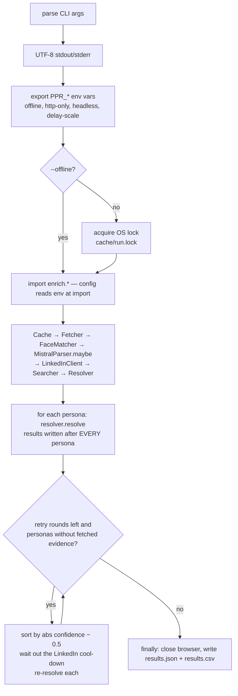
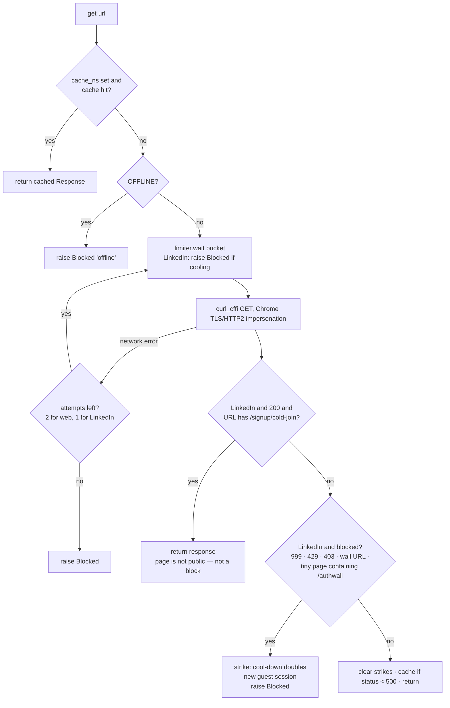
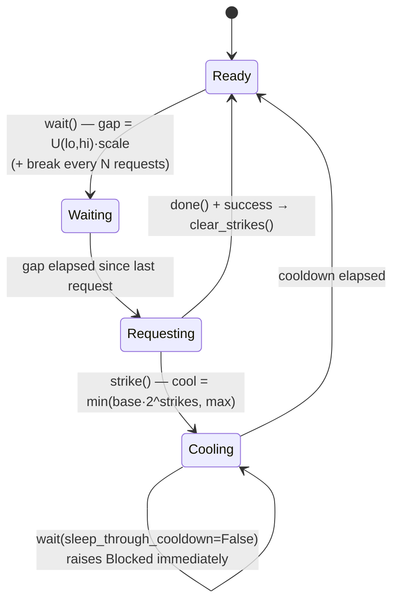
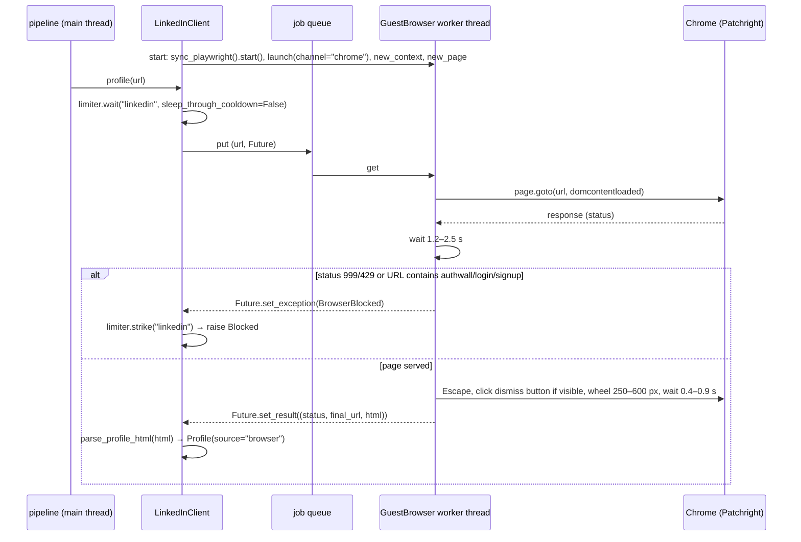

# Under the hood

This document walks through the code: what each module holds, what each important function does and why, how state moves between components, and how failures are handled. Read the [README](../README.md) first for the big picture; this is the reference for anyone changing the code.

---

## Contents

1. [Process lifecycle (`run.py`)](#1-process-lifecycle-runpy)
2. [The network layer (`net.py`)](#2-the-network-layer-netpy)
3. [The cache (`cache.py`)](#3-the-cache-cachepy)
4. [The anonymous browser (`browser.py`)](#4-the-anonymous-browser-browserpy)
5. [Persona model and parsing (`persona.py`, `textutil.py`)](#5-persona-model-and-parsing)
6. [Persona enrichment (`sources.py`)](#6-persona-enrichment-sourcespy)
7. [Search and snippets (`search.py`)](#7-search-and-snippets-searchpy)
8. [LinkedIn parsers and client (`linkedin.py`)](#8-linkedin-parsers-and-client-linkedinpy)
9. [Faces (`face.py`)](#9-faces-facepy)
10. [Candidates and features (`features.py`)](#10-candidates-and-features-featurespy)
11. [Orchestration (`pipeline.py`)](#11-orchestration-pipelinepy)
12. [Scoring, intervals, calibration (`scorer.py`, `calibrate.py`)](#12-scoring-intervals-calibration)
13. [Optional LLM (`llm.py`)](#13-optional-llm-llmpy)
14. [Failure modes and how each is handled](#14-failure-modes-and-how-each-is-handled)
15. [Extending the system](#15-extending-the-system)

---

## 1. Process lifecycle (`run.py`)

**Environment before import.** `config.py` reads `PPR_*` variables at import time. `run.py` therefore sets them from the CLI flags *before* importing `enrich`, which is why those imports sit inside `main()`.

**Single-instance lock.** `_single_instance_lock()` opens `cache/run.lock` and takes an OS-level exclusive, non-blocking lock: `msvcrt.locking` on Windows, `fcntl.flock` elsewhere. The handle stays open for the whole process, and the OS releases it on exit, even after a crash. `--offline` skips the lock because it makes no network requests and only reads the cache (it does write a few derived entries, such as face embeddings, which is safe with SQLite).

**Incremental output.** `_write()` rewrites `results.json` and `results.csv` after every persona. A crash or Ctrl-C loses at most the persona in progress.

**Errors are contained.** Any exception inside `resolve()` becomes a result with `status: "error"`, so one bad persona never ends the run.

**Retry rounds.** `_needs_refetch(r)` is true when a result has a URL but its winning candidate has no fetched evidence (`profile.fetched` is false). Each round:
1. sorts those personas by `|confidence − 0.5|`, most uncertain first, because a fetch there can actually change the decision
2. sleeps until the LinkedIn cool-down has passed
3. calls `resolve()` again

Searches, sites and posts are cached, so a retry costs only the requests that failed before.

---

## 2. The network layer (`net.py`)

### `Fetcher.get(url, bucket, cache_ns, linkedin)`

The single entry point for every plain-HTTP request (search goes through `ddgs`, the browser through `browser.py`).

- **Fingerprint.** `curl_cffi.Session(impersonate="chrome")` sends a real Chrome TLS ClientHello (JA3/JA4) and HTTP/2 settings, with a consistent `Accept-Language`. There's no user-agent rotation, because a UA that disagrees with the TLS fingerprint is itself a bot signal.
- **Guest session reset.** After a block, `_new_session()` throws away the guest cookies LinkedIn issued (`bcookie`, `JSESSIONID`), just as a visitor clearing cookies would. It's always combined with a cool-down, never used instead of one.
- **Cached responses** are stored as JSON with the body in latin-1 (byte-exact round trip) plus the status, the final URL and the content type. Images go through the same path, under namespace `img`.
- **LinkedIn calls are never retried** inside `get`. The caller decides what to do with a `Blocked`.

### `RateLimiter`

State per **bucket** (a string such as `linkedin`, `linkedin:posts`, `linkedin:company`, `search:bing`, `web`). The **family** (the part before `:`) selects the delay table, so `linkedin:posts` is paced like LinkedIn but cools down independently.

| Field | Meaning | Persisted in the cache? |
|---|---|---|
| `_last[bucket]` | time of the last request | no |
| `_count[bucket]` | requests so far (drives the periodic breaks) | no |
| `_blocked_until[bucket]` | end of the current cool-down | **yes**, namespace `cooldown` |
| `_strikes[bucket]` | consecutive blocks | **yes**, namespace `strikes` |

Persisting `cooldown` and `strikes` matters. Without it, every restart forgot the escalation, so LinkedIn kept being asked every 2 minutes while it was clearly refusing.

**Default delays** (`config.BUCKET_DELAYS`):

| Family | Delay |
|---|---|
| linkedin | 4–9 s |
| search | 2–5 s, per backend |
| web | 1–3 s |
| llm | 1.2–2 s |

**Breaks:** LinkedIn 30–90 s every 25 requests; search 20–60 s every 40.

**Backoff:** 2 min doubling to 30 min. Everything is multiplied by `DELAY_SCALE`.

### `log()`

Prints with an `HH:MM:SS` prefix and `flush=True`, so log files and monitors see each line immediately.

---

## 3. The cache (`cache.py`)

A single SQLite table, `kv(ns TEXT, key TEXT, value BLOB, ts REAL, PRIMARY KEY(ns, key))`, opened with `check_same_thread=False` and guarded by a `threading.Lock`, because the browser runs in another thread.

| Namespace | Key | Value | Written by |
|---|---|---|---|
| `http` | URL | cached Response (status, url, body, content-type) | `Fetcher.get` (websites, Bluesky, GitHub) |
| `img` | image URL | cached Response with image bytes | `FaceMatcher._image` |
| `face` | image URL without the `&t=` token | `{emb[128], score, size, n_faces}`, or `{}` = no face | `FaceMatcher.embedding` |
| `search` | query string | list of `{href, title, body, backend}` | `Searcher.search` |
| `profile` | canonical `/in/` URL | `Profile.to_dict()` (only when `ok` or a 404) | `LinkedInClient.profile` |
| `post` | post URL | parsed author block, or `{}` = not public / unparsable | `LinkedInClient.author_from_posts` |
| `company` | company URL | parsed company facts, or `{}` | `LinkedInClient.company` |
| `llm` | intro text | Mistral JSON | `MistralParser.parse_intro` |
| `cooldown` | bucket | epoch seconds the cool-down ends | `RateLimiter.strike` |
| `strikes` | bucket | consecutive blocks | `RateLimiter.strike` / `clear_strikes` |

- **Blocked LinkedIn results are never cached**, so a later run can still succeed.
- **Negative results are cached as `{}`** (a photo without a face, a non-public post), so the same request isn't repeated.
- **To force a refetch**, delete the key: `Cache.delete(ns, key)`.

---

## 4. The anonymous browser (`browser.py`)

Playwright's sync API objects belong to the thread that created them. On Windows the default event loop also can't start subprocesses inside some hosts. `GuestBrowser` therefore owns a **dedicated worker thread** with its own `ProactorEventLoop`, and the rest of the program talks to it through a queue.

- **Launch:** `channel="chrome"` (real Google Chrome) with a fallback to the bundled Chromium, `--disable-blink-features=AutomationControlled`, headful unless `--headless`. Patchright already patches the `navigator.webdriver` and CDP `Runtime.enable` leaks.
- **One browser, one context, one tab** for the whole run, like a single person browsing. No logins, no stored profile directory.
- **The sign-in modal** is dismissed (Escape plus the known dismiss buttons) because the profile content is already in the DOM behind it. A **hard authwall redirect** is reported as `BrowserBlocked` and never worked around.
- **`try_start()`** returns `None` if Patchright or Chrome is unavailable. `LinkedInClient` then falls back to plain HTTP for the rest of the run.

---

## 5. Persona model and parsing

### `Persona` (dataclass)

| Group | Fields |
|---|---|
| identity | `raw`, `pid` (SHA1 of the raw JSON), `display_name`, `first`, `last`, `last_initial`, `name_complete` |
| companies | `companies` (strong), `weak_companies`, `li_companies` (LinkedIn company pages the persona's site links) |
| role | `titles` |
| web | `domains`, `urls` |
| words | `keywords`, `rare_terms` |
| location | `country` (stated), `city_hint`, `tz_country`, `tz_region`, `tz_weak` |
| company facts | `industry`, `size` (`(lo, hi)` employees) |
| social | `socials`, `twitter`, `bluesky`, `github`, `linkedin_hint` |

`kind` is `type1` when a full name is known, otherwise `type2`.

### `parse_name(name)`

1. A bracketed part becomes `hint`: "Jane Roe (Acme)" → hint "Acme", which is later added as a company.
2. A single token is tried as `FirstnameX` (initial), then `FirstLast` (camel case), then a plain first name.
3. A trailing single letter, with or without a dot, becomes `last_initial`; anything longer becomes `last`.
4. Two or more full tokens → `complete=True`.

### `parse_intro(intro)`, in order

1. **URLs and bare domains:** each registrable domain (`co.uk`-aware) goes to `domains`; social hosts are excluded.
2. **Asides removed:** `Tools: …`, `Looking for: …`, `Interests: …`, `Skills: …`.
3. **Strong companies** from patterns: `@ X`, `at X`, `(founder|ceo|owner|cto|head|lead) of X`, `Name (https://…)`, and the label of each domain.
4. **Segments** (split on `| / + ; • ·`, sentence ends, "Cap, Cap" commas, and dashes):
   - a segment containing a role word from `TITLE_WORDS` becomes a **title**, cut at `@`/`at`
   - "in UK" / "from …" inside a segment sets `country`
   - a short capitalised segment that is neither a country nor a title becomes a **weak company**
5. `City, ST` with a valid US state code → `city_hint` and country US; "based/located/living in X" → country.
6. `keywords` = tokens without stopwords, at most 25.

All companies are deduplicated by `norm_company`, which lower-cases, strips accents and the bracketed part, drops TLDs, and removes suffixes such as Inc / LLC / Labs / AI / Software.

### `textutil.py` tables and helpers

- **Tables:**
  - country names → ISO2
  - US states (codes and names)
  - ~120 cities → country
  - timezone → country (US zones as a set; UTC-like zones in `WEAK_TZ`)
  - country → region
  - nicknames
  - role words, seniority levels, title abbreviations
  - common words that are useless as search terms
- **`country_from_text`** checks longest names first. Short codes ("US", "UK") count only as uppercase standalone tokens in the raw text, so "us" as a word doesn't count. Then state names, `, ST` suffixes and cities.
- **`tz_prior`** returns `(country, region, weak)`.
- **`seniority`** maps a title to 0–5, with founder/CEO/chief highest.
- **`parse_size`** handles `11-50`, `11–50`, `1,001-5,000` and `10,001+`.

---

## 6. Persona enrichment (`sources.py`)

`persona_links(persona, fetcher, searcher)` returns `(candidates, extras)`.

### Websites: `analyse_site(url, persona, fetcher)`

1. Fetch `url`; if that fails, fetch `https://<registrable domain>`.
2. Parse with lxml. The site name is the first of `og:site_name` / `application-name` / `<title>` that, cut at the first `| - – — : ·` separator, is 3–40 characters long. Otherwise it falls back to the domain label.
3. Collect same-domain links whose last path segment or URL mentions `about`, `team`, `founder`, `people`, `who-we-are`, `company`, `story` or `contact`, and fetch up to 2 of them.
4. From the raw HTML of all pages: every valid `linkedin.com/in/…` (through `canonical_profile`) and every `linkedin.com/company/…`.
5. From the visible text (scripts, styles and SVGs removed): **mentions**, windows of 160 characters before and 220 after each occurrence of the full name, or else the last name, at most 6.

Direct profile links become candidates with `source="website"` and `page_profiles` = how many distinct profiles the pages contain. More than 3 makes it a team page with a smaller weight.

### Social bios

- **Bluesky:** `public.api.bsky.app/xrpc/app.bsky.actor.getProfile` → display name + description.
- **GitHub:** `api.github.com/users/<handle>` (no auth, 60 requests per hour) → name, company, bio, location, blog, twitter.
- **X:** `handle_bio()` searches `"<handle>" twitter OR x.com`, then `x.com/<handle>`, and keeps the title and body of results whose URL is the profile page.

Any LinkedIn link inside a bio becomes a `source="persona"` candidate.

### Folding back: `persona.enrich(p, extras)`

1. `li_companies` are stored on the persona.
2. **Site names are added as strong companies.** The persona chose to link that organisation.
3. **Bios are cleaned** by `clean_social_bio`, then parsed with `parse_intro`:
   - crawler placeholders and "Name (@handle) / X" boilerplate are removed
   - the persona's own handles are dropped
   - `@company_hq` style handles become `@ Company`, so they parse as companies
4. From that text and from site mentions:
   - companies are added as **weak**
   - titles are added after stripping the person's name and connecting words ("Jane Doe is Head of …" → "Head of …"), and only if they are 5 words or fewer
   - a stated country is added if none was known
   - keywords and domains are merged
5. Every addition is recorded in `notes`, which appear as `persona_enrichment` in the output.

---

## 7. Search and snippets (`search.py`)

### URL canonicalisation

- **`canonical_profile`** accepts any `xx.linkedin.com/in/<slug>`, URL-decodes and lower-cases the slug, and requires `^[\w-]{3,100}$`. It rejects `me` and `edit`. It returns `https://www.linkedin.com/in/<slug>` with the slug percent-encoded.
- **`profile_from_post`** maps `/posts/<slug>_<rest>` to the author's canonical profile.
- **`canonical_company`** does the same for `/company/<slug>`.

### `Searcher.search(query)`

1. Return the cached result (namespace `search`) if present.
2. Backends are tried in rotation: the first two alternate between calls, and backends with 3 or more consecutive failures are moved to the end; after 6 they are skipped.
3. Per backend:
   - `limiter.wait("search:<backend>")`
   - `DDGS(timeout=12).text(query, max_results, backend=…)`
   - "No results found" is not logged as an error
4. The first non-empty answer wins. The result is cached even when empty, so a dead query isn't repeated.

### `parse_snippet(title, body)`

| Step | Detail |
|---|---|
| Title cleanup | Remove `- LinkedIn …`, cut at the first `...`/`…` (Bing splices the next result after it), split on ` - `/` – `/` \| ` → name, headline, company |
| Body cut | When the body contains `profile on LinkedIn …...`, cut after it; the rest belongs to the next result |
| Labelled fields | `Experience:`, `Education:`, `Location:` |
| Newer Bing layout | `<Name> <Headline> <City, Region, Country> N followers … See your mutual connections <Company>` |
| Fallbacks | `@ Company` / `at Company` in the headline; `City, Region · ` in the body |
| `text` | Only this result's own title and body; used for keyword and company-in-text checks |

---

## 8. LinkedIn parsers and client (`linkedin.py`)

### `Profile` (dataclass)

Fields: `url`, `ok`, `source` (`guest_http` · `browser` · `post` · `snippet`), `name`, `headline`, `location`, `country`, `companies`, `company_urls`, `websites`, `education`, `about`, `posts`, `awards`, `image_url`, `connections`, `error`.

### `parse_profile_html(src, url)`

- **JSON-LD `Person` node:**
  - name; `address.addressLocality` / `addressCountry`
  - `worksFor[]` names and URLs, current first
  - `alumniOf[]` schools
  - `jobTitle` (usually masked for guests)
  - `description` (About)
  - `awards`, `image.contentUrl`
- **JSON-LD posts by the same author:** `DiscussionForumPosting` / `Article` / `SocialMediaPosting`, first 600 characters each.
- **`og:title`:** company after ` - `.
- **Meta description:** `Experience: … · Education: … · Location: … · 500+ connections`, plus the About text when guests can see it.
- **Top card:**
  - `data-section="websites"` links, unwrapped from `/redir/redirect?url=` — this is the **company website**
  - `currentPositionsDetails` company URLs
  - `<h1>` name fallback

**Masked values** are dropped: `MASK_RE` matches strings made only of `*` and punctuation. A ghost or static placeholder image is discarded, so face matching never runs on a silhouette. `ok` = a name was found.

### `parse_post_html(src, url)`

Reads the post's JSON-LD `author`: name, profile URL, `image.url`, and the follower count from `interactionStatistic`. If the JSON-LD has no image, the `` avatar is used. Also the post text and date.

### `parse_company_html(src, url)`

- JSON-LD `Organization`: name, description, `sameAs` (website), `numberOfEmployees` (people on LinkedIn).
- The `data-test-id="about-us__*"` blocks: industry, size bucket, website (unwrapped), headquarters.

### `LinkedInClient`

| Method | Behaviour |
|---|---|
| `profile(url)` | Cache → (offline? error) → browser fetch (`_via_browser`) or plain HTTP (`_via_http`). On `Blocked`, return `Profile(error="blocked: …")` **without caching**. Cache when `ok` or a 404. |
| `_via_browser` | Non-blocking cool-down check → `GuestBrowser.fetch` → `BrowserBlocked` = strike + raise; success = clear strikes; any other error is treated as blocked for this attempt |
| `author_from_posts(profile_url, post_urls)` | Up to 2 posts, each from the cache or fetched with plain HTTP (bucket `linkedin:posts`). Keep only posts whose author URL canonicalises to `profile_url` (reposts are ignored). Build `Profile(ok=True, source="post")` from the author name, photo and texts. |
| `company(url)` | Cache → plain HTTP (bucket `linkedin:company`) → `parse_company_html`; cached even when empty |

---

## 9. Faces (`face.py`)

1. **Models:** YuNet (`face_detection_yunet_2023mar.onnx`, 230 KB) and SFace (`face_recognition_sface_2021dec.onnx`, 37 MB), downloaded from `opencv_zoo` into `models/` on first use.
2. **`drive_direct()`** turns a Drive share link into `uc?export=download&id=<id>`.
3. **`embedding(url)`:**
   - fetch the image through the polite fetcher (cached as `img`)
   - decode with `cv2.imdecode`
   - downscale to at most 640 px
   - `FaceDetectorYN.detect`, keeping the **largest** face
   - `FaceRecognizerSF.alignCrop` + `feature` → a 128-d embedding
   - cache `{emb, score, size, n_faces}`, or `{}` when there's no face
4. **`similarity(a, b)`** = cosine. The levels in `features.face_level` are ≥ 0.50 strong, ≥ 0.363 likely (SFace's published threshold), ≥ 0.25 unclear, otherwise mismatch.

Persona photos may not show a real face. In that case the persona embedding is `None` and the whole face channel is skipped for that persona.

---

## 10. Candidates and features (`features.py`)

### `Candidate` (dataclass)

Fields: `url`, `sources` (set), `snippets`, `post_urls`, `company_info`, `best_rank`, `page_profiles`, `profile`, `face_sim`, plus outputs `levels`, `evidence`, `score`, `prob`.

**`view()`** merges everything known about the candidate into one dict:

| Key | Source |
|---|---|
| name | profile → first snippet → name from a multi-part slug |
| headlines | profile headline + every snippet headline |
| companies | profile companies + snippet companies |
| company_slugs | profile company URLs + company-page URLs |
| websites | profile websites + company-page websites |
| location, country | profile, else first snippet location (country via `country_from_text`) |
| education, about, posts | profile (+ snippet education) |
| snippet_text | every snippet's own text |
| company_facts, image_url, fetched | company pages, profile |

Every comparator reads only this view, so it doesn't matter whether a fact came from a snippet, a profile, a post or a company page.

### Comparators (each returns `(level | None, evidence dict)`)

- **`name_level`:**
  - drop honorifics and bracketed parts
  - `first_sim` = best of `_first_match` over the first two tokens (exact 1.0, nickname 0.95, prefix 0.9, else Jaro-Winkler)
  - with a known last name: `last_sim` = best Jaro-Winkler against the remaining tokens (0.97 when the surname appears inside the joined name)
  - an initial-only surname that agrees → `partial`
  - first ≥ 0.9 and last ≥ 0.93 → `full`; both ≥ 0.85 → `partial`; only last → `last_only`; else `mismatch`
  - first name only: `first_initial` if the initial agrees, otherwise `mismatch`; with no initial → `first_only`
- **`company_level`:**
  1. a LinkedIn company page linked from the persona's site matches the candidate's company slug → strong
  2. strong persona companies + rare terms (≥ 8 characters) vs companies / headlines / slugs (`_company_sim` ≥ 88) → strong
  3. a strong company appears in the snippet text → strong
  4. any company in the about text or posts → weak
  5. weak companies vs fields → weak
  6. otherwise `mismatch` if the persona has strong companies, else `None`

  `_company_sim` = 100 when equal; 90 for a long shared prefix; 95 when one name is a whole word inside the other; else `token_set_ratio`.
- **`domain_level`:** an intro domain is in the candidate's websites, appears in the snippet or about text, or its label is contained in a company slug.
- **`title_level`:** both sides go through `expand_title` (abbreviations) → `token_set_ratio` ≥ 85 strong; same seniority or ≥ 60 weak; else mismatch. With no headline: an exact title phrase of 2+ words in the candidate's posts or about text → weak.
- **`location_level`:** stated country first (or city hint in the location); then the timezone country (if not weak); then the timezone region.
- **`social_level`:** a persona handle on the profile or in its text; a handle that equals the candidate's name tokens glued together (or that plus ≤ 2 characters) → `handle_name`; the candidate's slug linked from a persona bio or site → `match`.
- **`keyword_level`:** the persona keywords minus name tokens (needs ≥ 3), against headline / about / snippets / posts, exact or long-prefix; overlap fraction ≥ 0.30 high, ≥ 0.12 some, else none.
- **`industry_level`:** a company-page industry, compared fuzzily (≥ 80), by synonym words (`INDUSTRY_SYNONYMS`) or by 2+ synonym hits in the company description → `company_match` / `company_mismatch`; otherwise synonym words in free text → `match` / `none`.
- **`size_level`:** the persona `(lo, hi)` overlaps the company-page bucket → match, else mismatch.
- **`face_level`**, **`source_level`:** see above. Persona links on pages with ≤ 3 profiles → `persona_link`, more → `team_page`.

`extract(persona, c, extras)` runs all of them and stores `c.levels` and `c.evidence`.

---

## 11. Orchestration (`pipeline.py`)

### `build_queries(p)`, at most 7 and deduplicated

| Persona | Queries, in order (tight first) |
|---|---|
| Type 1 | `"Full" "Company" site:linkedin.com/in` for up to 2 companies · `"Full" <most senior title>` · `"Full" <city>` · `"Full" <2 rare words>` (only without a stated company) · `"Full" site:…` · `Full Company linkedin` · `Full <twitter handle> linkedin` · `"Full" domain linkedin` · `Full linkedin <Country>` · `"Full" <weak company> linkedin` |
| Type 2 | `"First" "Company"` · `"First" title industry country site:…` · `"First" title "industry" linkedin` · `"First" title country site:…` · `"First" industry country site:…` |

`_distinctive(p)` picks rare words: intro keywords of 5+ characters that are not common, not role words, not countries, and not part of the name or a company. Longest first.

### `Resolver.resolve(raw)`, step by step

1. `persona.build` → `persona_links` → `persona.enrich` → `rare_terms`.
2. Persona-published links go into the pool.
3. For each query:
   - profile results → `_add` with the parsed snippet. `_snippet_fits_url` rejects snippets whose name shares nothing with the slug; Jaro-Winkler over slug windows tolerates transliterations.
   - post results → `_add` with a synthetic snippet (name from a fused slug via `_name_for_fused_slug`) and the post URL remembered.
   - re-score; **stop** once the leader is a full-name match with p ≥ 0.80.
4. No full-name candidate at all → add slug guesses.
5. Rank; drop name mismatches (unless nothing else is left); pick persona-linked candidates + the best others, up to `TOP_K_FETCH`.
6. Persona face embedding (if any).
7. For each pick, until `_decided`: `_gather` (profile → posts) and, when the persona has size, industry, domains or site company pages, `_company_facts`; re-score.
8. **Face sweep:** plausible-name candidates (not `None`, not mismatch), up to `FACE_SWEEP_MAX`, until `_decided`: `_gather` for those without `face_sim`.
9. Final ranking → `_result`.

### Helpers

| Helper | Behaviour |
|---|---|
| `_score_pool` | Recomputes all levels; counts namesakes (other full / first+initial matches); a first-name-only persona assumes ≥ 3, a known initial ≥ 1; score, probability, store the namesake count |
| `_decided` | The leader has fetched evidence, p ≥ 0.95, and is ≥ 0.5 ahead of the runner-up |
| `_gather` | Profile first; a 404 removes the candidate. If the profile isn't ok, or the persona has a face but the profile has no photo → `author_from_posts` (post URLs from the pool, or `_find_posts` with a `linkedin.com/posts/<slug>` search). A post profile **fills in** a fetched profile (photo, posts) or replaces a failed one. Then face similarity |
| `_company_facts` | Company URL from the profile, else `_find_company(name)` (search `"Name" site:linkedin.com/company`, accept a result whose title matches the name at ≥ 85), then `LinkedInClient.company` |
| `_result` | Status rules; interval; `fields_validated`; per-field evidence with weights; profile summary (including `via`); top-3 alternatives; enrichment notes; up to 8 scored candidates with their levels (input for `calibrate.py`) |

---

## 12. Scoring, intervals, calibration

**`scorer.py`:**
- `WEIGHTS[field][level]`: see the table in the README.
- `contributions(levels)` keeps only known levels.
- `raw_score = PRIOR + Σ contributions + collision_penalty(n)`, where `collision_penalty(n) = −0.9·log₂(1+n)`.
- `probability(s) = σ(A·s + B)`, with `A, B` loaded from `models/calibration.json` at import (default `1, 0`).
- `interval(levels, n)`: 400 draws with a fixed seed. Each draw multiplies every contribution by `exp(N(0, 0.35))` and uses bootstrap pair `i mod 200` → 5th and 95th percentile, widened if needed so the interval always contains the point estimate.
- `fields_validated(levels)`: comparable fields (known level, `source` excluded), split into positive weight (agreed) and negative weight (disagreed).

**`calibrate.py`:**
1. `load()` reads one or more result files and the label map (name → URL or `null`). For each labelled persona, each stored candidate becomes one row: `(raw_score(levels, same_name), label)`.
2. `fit()`: `LogisticRegression(C=0.3)` on the single score feature. It needs both classes. Strong L2 keeps the fit sane when the classes are separable.
3. 200 bootstrap refits (resampling rows with replacement); failed refits are skipped.
4. Reports top-1 accuracy per persona and the Brier score before and after, then writes `{a, b, bootstrap, n_candidates, n_personas}`.
5. **After changing weights or features, re-run calibration.** The stored `a, b` are only valid for the scores they were fitted on.

---

## 13. Optional LLM (`llm.py`)

`MistralParser.maybe()` returns `None` unless `MISTRAL_API_KEY` is set. `parse_intro(intro)` makes one REST call to `api.mistral.ai/v1/chat/completions` (model `mistral-small-latest`, temperature 0, JSON response) asking for `companies`, `titles` and `country` — "do not guess". It is cached by intro and rate-limited as `llm`; failures return `None`. In `persona.build` the LLM only adds values the rules didn't already find.

---

## 14. Failure modes and how each is handled

| Situation | Detection | Handling |
|---|---|---|
| LinkedIn throttles (999 / 429 / authwall) | status, final URL or authwall stub (`net._is_blocked`, `browser._load`) | per-channel strike → doubling cool-down (persisted), new guest session; the persona continues on other evidence; retry rounds later |
| A single page needs login (non-public post) | 200 + `/signup/cold-join` | treated as unavailable and cached as `{}`; no cool-down |
| Cool-down active | `RateLimiter.cooling()` | LinkedIn: immediate `Blocked`, no sleep; other hosts: sleep it out |
| Profile 404 | status 404 | candidate removed from the pool; cached |
| Search backend fails or returns nothing | exception or empty list | next backend; dead backends deprioritised, then skipped |
| Website down | fetch error or status ≥ 400 | parent domain tried; otherwise skipped with a log line |
| Bing splices results | `...` in the title, `profile on LinkedIn ...` in the body, name/slug mismatch | truncated, or the snippet is rejected |
| Junk profile URLs in markup | slug regex | never become candidates |
| Photo has no face / is a placeholder | YuNet finds nothing / static or ghost URL | face channel `None` (no penalty) |
| Browser or Chrome unavailable | `try_start` fails | plain-HTTP fallback for the rest of the run |
| Network down (e.g. after sleep) | DNS / connection errors | treated as a failed attempt; persona scored on what it has; retry rounds |
| Two runs at once | lock acquisition fails | the second exits with a clear message |
| Non-ASCII output on Windows | — | stdout/stderr reconfigured to UTF-8 |
| A persona throws | exception in `resolve` | `status: "error"` result; the run continues |

---

## 15. Extending the system

- **A new evidence field:**
  1. write `my_level(persona, v)` in `features.py`, returning `(level | None, evidence)` and reading only `c.view()`
  2. register it in `extract()`
  3. add `WEIGHTS["my_field"] = {level: weight}` in `scorer.py`
  4. add a synthetic test
  5. re-run `calibrate.py`
- **A new candidate source:** add candidates through `Resolver._add(pool, url, source, snippet, rank)`. Give the source a level in `source_level` if it deserves its own weight.
- **A new persona source** (e.g. another social API): fetch it in `sources.persona_links` into `extras[...]` and fold it into the persona in `persona.enrich`. Every later stage picks it up automatically.
- **A paid search API:** implement it as another backend in `Searcher.search`. The cache and rotation stay the same.
- **Learned weights:** once a few hundred labelled pairs exist, replace the single-feature Platt fit in `calibrate.py` with a logistic regression over one-hot `levels`. `scorer.raw_score` would then read the learned coefficients instead of `WEIGHTS`.
